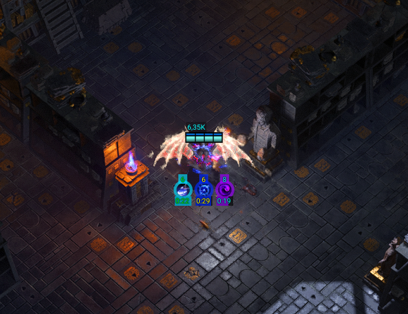

Tracker
=======



Tracker — плагин для GameHelper, показывающий эффекты статуса, визуальные эффекты на земле и вспомогательные маркеры для монстров.

Ключевые возможности
- Отслеживание и отображение эффектов статуса (`StatusEffectLogic`)
- Визуализация Ground Effects (`GroundEffectLogic`)
- Линии и подсказки для монстров (`MonsterLineLogic`)

Сборка
1. Откройте [Tracker/Tracker.sln](Tracker/Tracker.sln) в Visual Studio или выполните:

```bash
dotnet build Tracker/Tracker.sln -c Release
```

2. Результирующие файлы появятся в `Tracker/bin/Debug/net8.0/` или `Tracker/bin/Release/net8.0/` в зависимости от конфигурации.
3. Проект содержит цель `CopyFiles` в `Tracker/Tracker.csproj`, которая копирует собранные файлы в папку GameHelper Plugins при сборке.

Установка и использование
1. Скопируйте содержимое папки сборки в папку плагинов GameHelper, например:

```text
GameHelper/bin/Debug/net8.0/Plugins/Tracker/
```

2. Перезапустите GameHelper, чтобы загрузить плагин.

Релизы
- Текущий релиз: v1.0.3 — см. страницу релизов на GitHub: https://github.com/hyper911/Tracker-GH2/releases
- В релиз включены бинарные файлы и иконки (`status_icons.png`).

Скриншоты
- Пример: `Assets/Screenshot_1.png` (прикреплён к релизу).

Контрибуция
- Создавайте issues для багов и предложений. Pull requests приветствуются.

Лицензия
- Проект распространяется под лицензией MIT — см. файл [LICENSE](LICENSE).

Контакты
- Открывайте issues на GitHub или пишите PR — спасибо за помощь!
